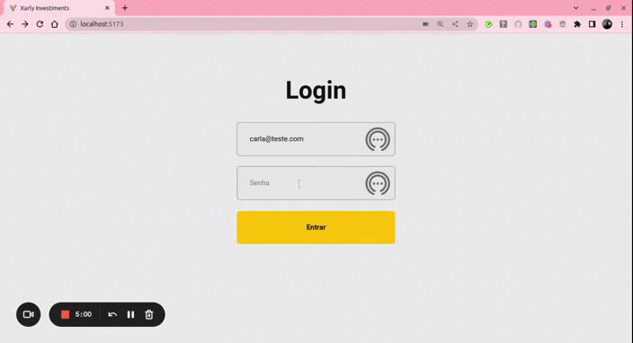

<h1 align="center">
     📈<a href="#" alt="blog"> Xarly Investiments </a>📉
</h1>
<h2 align="center">
	🚀Concluído🚀
</h2>

<br>

Tabela de conteúdos
=================
<!--ts-->
   * [Sobre o projeto](#-sobre-o-projeto)
   * [Tecnologias](#-tecnologias)
   * [Como executar o projeto](#-como-executar-o-projeto)
     * [Pré-requisitos](#pré-requisitos)
     * [Rodando a aplicação](#user-content--rodando-a-aplicação)
   * [Layout](#-layout)
   * [Autora](#-autora)
<!--te-->

<br>

## 💻 Sobre o projeto

  Aplicação que simula uma carteira de compra e venda de ações da bolsa de valores.
  <br>
  Desenvolvida em React com Hooks para deixar o código mais legível e objetivo, além de deixar o compartilhamento de estados e manutenção de código mais fáceis.
  <br>
  Para o desenvolvimento da aplicação, foi criada e utilizada uma pequena API com informações fictícias, que está no repositório: https://github.com/carlatakagi/equities-api
  <br>
  Para estilizar o projeto, foi utilizado CSS puro e com o máximo de responsividade para se adequar a vários tamanhos de tela. A escolha de estilizar com CSS puro foi por organização e fácil manutenção devido ao prazo, mas gostaria de ter utilizado o Tailwind CSS para ampliar meu conhecimento.
  <br>

#### ➤ **Principais Funcionalidades**

- **Tela de Login**
  <br>
  Possui um formulário com dois campos para preencher o e-mail e a senha do usuário, também é validado se a informação é um e-mail e se a senha possui no mínimo 6 caracteres. Ao clicar no botão de "Entrar", as informações de e-mail e data de acesso serão salvas em um estado e o usuário (e-mail) será apresentado no cabeçalho das próximas páginas.
  <br>

- **Tela de Lista de Ações**
  <br>
  Esta tela mostra ao usuário, todas as suas ações compradas e as disponíveis para compra, além do cabeçalho com o e-mail do usuário logado.
  <br>
  Na seção de ações compradas, caso o usuário ainda não tenha adquirido nenhuma ação, irá aparecer a seguinte mensagem "Você ainda não possui ações.", caso contrário, irá aparecer suas compras, quantidades, valor e dois botões para comprar (C) ou vender (V) estas ações.
  <br>
  Na seção de ações disponíveis, irá aparecer somente as ações que não foram adquiradas pelo usuário, com o nome da ação, a quantidade disponível, o valor unitário e um botão para comprar a ação selecionada.
  <br>
  Ao final da página, existe um botão para realizar saque ou depósito na conta do usuário e que ao clicar, redireciona a pessoa para a página que realiza saque e depósito.
  <br>

- **Tela de Compra e Venda de Ações**
  <br>
  Ao clicar em um dos botões de comprar ou vender ações na página anterior, o usuário será direcionado para a tela de compra e venda de ações, mostrando as informações do produto selecionado.
  <br>
  Nesta tela, o usuário poderá digitar a quantidade de ações que quer comprar ou vender, e, caso esta quantidade esteja disponível, a operação é realizada com sucesso e retorna a página anterior, com as informações atualizadas.
  <br>
  Também existe um botão ("Voltar") que o usuário poderá clicar para retornar a página anterior.
  <br>

- **Tela de Depósito e Saque**
  <br>
  Ao clicar no botão d "Depósito/ Saque' ao final da página de ações, o usuário será redirecionado para a página de saque e depósito. A pessoa poderá digitar o valor no campo em branco e selecionar a opação desejada (saque/depósito). Então clicar em confirmar para realzar a operação ou clicar em 'Voltar' para retornar a página anterior.
  <br>

#### ➤ **Deploy da Aplicação**
  A plataforma escolhida para realizar o deploy foi o Vercel App, por ter uma performance melhor para React do que as outras opções encontradas.
- https://xarly-investiments.vercel.app/

#### ➤ **Implementações Futuras**
- Autenticação ao realizar login
- Estilizar com Tailwind CSS
- Gerar o código do cliente com UUID (Universally Unique Identifier)
- Implementar dark mode
- Criar e integrar com backend
- Testes
- Tratamento de Erros

---
## 🛠 Tecnologias

As seguintes ferramentas foram usadas na construção do projeto:

-   **[CSS](https://developer.mozilla.org/pt-BR/docs/Web/CSS)**
-   **[HTML](https://developer.mozilla.org/pt-BR/docs/Web/HTML)**
-   **[JavaScript](https://developer.mozilla.org/pt-BR/docs/Web/JavaScript)**
-   **[React](https://pt-br.reactjs.org/)**
-   **[Hooks](https://pt-br.reactjs.org/docs/hooks-intro.html)**

---
## 🚀 Como executar o projeto
#### 🧭 Rodando a aplicação

```bash

# Clone este repositório em seu terminal
$ git clone git@github.com:carlatakagi/xarly-investiments.git

# Acesse a pasta do projeto no seu terminal/cmd
$ cd xarly-investiments

# Instale as dependências:
$ npm install

# Inicialize o projeto:
$ npm run dev

```
---

## 🎨 Layout

Conheça a aplicação:

<a href="">
  
</a>

<p align="center">
  

  <a href="https://github.com/carlatakagi/instagram-page/commits/master">
    
  </a>

  <a href="https://github.com/carlatakagi/instagram-page/stargazers">
    

  </a>

</p>


---

## 🦸 Autora

 
 <sub><b>Carla Lurie Takagi</b></sub>
 <br />


[](https://www.linkedin.com/in/carla-takagi/)
[](mailto:carlatakagi@gmail.com)
---
